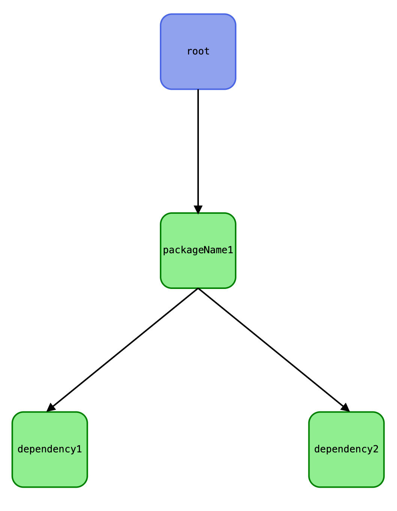
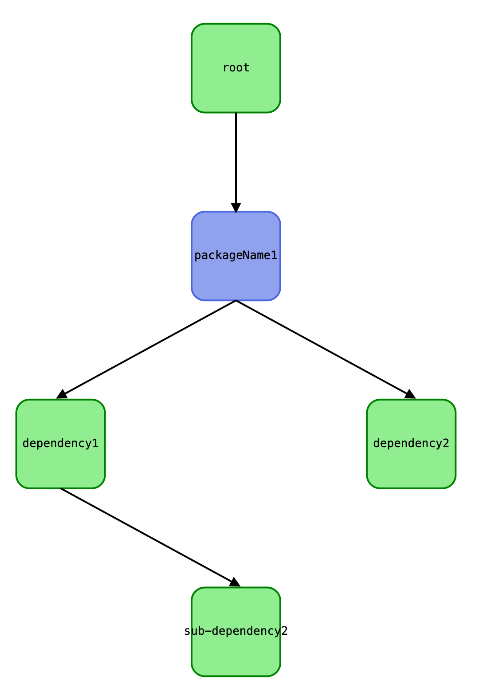

### `dependency-tree-svg`

This crate generates self-contained SVG files based on given JSON file with dependencies.

Dependencies must have the following format:

```json
{
    "root": [
        "packageName1"
    ],
    "packageName1": [
        "dependency1",
        "dependency2"
    ],
    "dependency1": [
        "sub-dependency2"
    ]
}
```

Then if you run

```sh
$ cargo run --bin run --features=lexopt -- --datafile data.json --write-to output.svg
```

You'll get an SVG file in `output.svg` which looks like this:



This tree is interactive, by clicking on the `packageName1` you'll get



This crate is a library, here's the interface:

```rust
fn generate_svg() {
    let file = std::fs::File::open("dependencies.json").unwrap();
    let reader = std::io::BufReader::new(file);
    let input: dependency_tree_svg::Input = serde_json::from_reader(reader)?;
    let box_size = 80;
    let svg = dependency_tree_svg::compile_svg(input, box_size);
    std::fs::write("output.svg", svg).unwrap();
}
```

### Frontend part

1. `npm install`
2. `npm run build:dev` to start `esbuild` in watch mode
3. open `assets/main.svg` in the browser
4. modify code in `assets/` directory
5. run tests with `npm run test:node`

### Releases

To release:

1. `npm run build:release` (to get minified JS)
2. `cargo publish --allow-dirty` (because generated JS files are not under git)
